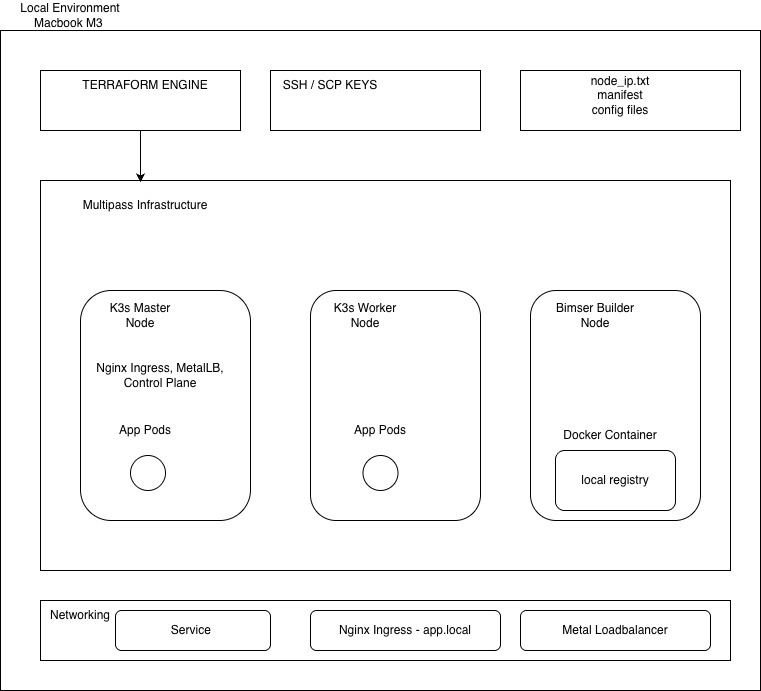
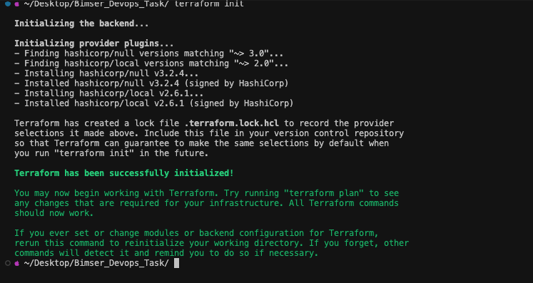
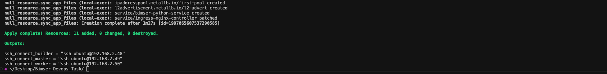
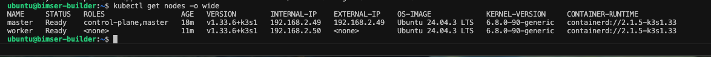
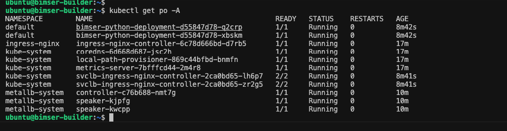
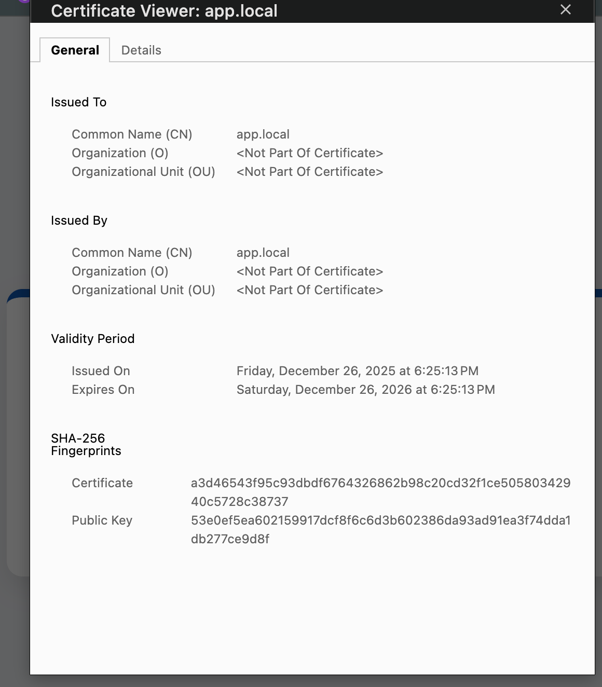
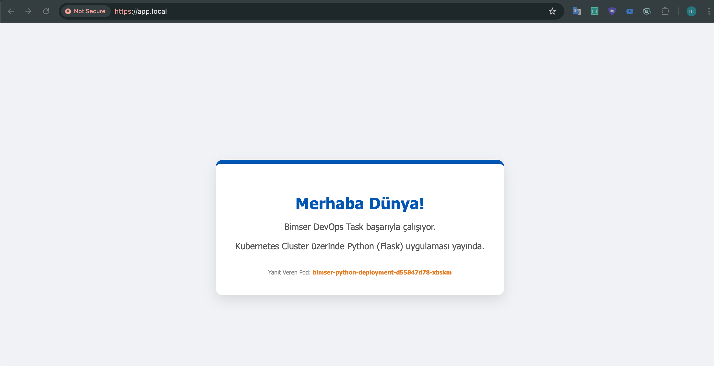

# Terraform & K3s ile On-Premise Kubernetes Otomasyonu

## 1. Proje Genel Bakış & Mimari

## 1.1 Proje Yapısı 

```text
Bimser_Devops_Task/
├── images/               # README için ekran görüntüleri ve diyagramlar
├── manifests/            # Kubernetes Deployment, Service, Ingress ve MetalLB dosyaları
├── terraform/            # Ana çalışma dizini
│   ├── app.py            # Flask Uygulaması
│   ├── Dockerfile        # İmaj Build talimatları
│   ├── infra.tf          # VM Oluşturma (Multipass)
│   ├── k3s-cluster.tf    # K3s, SSL, Registry ve Deployment otomasyonu
│   ├── variables.tf      # Değişken tanımları
│   └── provider.tf       # Terraform sağlayıcıları
└── README.md             # Proje dokümantasyonu
```
### 1.2 Özet

Bu proje, on-premise bir ortamda (Multipass VM'leri) tam otomatize edilmiş bir Kubernetes (K3s) cluster kurulumunu ve üzerine SSL destekli bir Flask uygulamasının dağıtımını kapsamaktadır. 

Süreç, sanal makinelerin oluşturulmasından uygulamanın HTTPS üzerinden yayına alınmasına kadar tek bir terraform apply komutu ile yönetilmektedir.

### 1.3 Yüksek Seviyeli Mimari Diyagram (Mantıksal)




### 1.3.1 Sistemin Mantıksal Katmanları:

Orkestrasyon Katmanı (Local): Terraform, yerel makine üzerinden tüm VM yaşam döngüsünü ve operasyonel scriptleri (provisioners) yöneten ana beyin rolündedir .

Yönetim ve CI/CD Katmanı (Builder Node): bimser-builder makinesi, cluster dışı bir yönetim merkezi olarak kurgulanmıştır. Uygulamanın imajını build eder, yerel Docker Registry'de saklar ve kubectl komutlarını cluster'a bu izole alandan iletir .

Kubernetes Kontrol Düzlemi Master & Worker Node: K3s kontrol düzlemi burasidir. System podlarinin ve uygulama podlarinin çalıştığı katmanlardir. 


Ağ Katmanı (Networking): MetalLB L2 modu ile servis IP'lerini yönetirken, Ingress Controller app.local üzerinden SSL sonlandırması yaparak trafiği içeriye alır .


### 1.3.2 Neden Bu Mimari?

M3 Mac & Mimari Tutarlılığı: Geliştirme ortamı Apple Silicon (ARM64) olsa bile, build işleminin Builder VM üzerinde yapılması, imajların hedef sunucu mimarisiyle %100 uyumlu olmasını sağlar .

Operasyonel Otomasyon: Terraform, sadece VM oluşturmakla kalmaz; Master node'dan token'ı alıp Worker'a taşır, kubeconfig dosyasını düzenleyip Builder'a enjekte eder ve SSL sertifikalarını otomatik oluşturur .

Hafiflik ve Performans: K3s kullanımı sayesinde, kısıtlı donanım kaynaklarında bile tam özellikli (Ingress, LB, Registry) bir Kubernetes deneyimi sunulur .


## 2.  Teknoloji ve Araçlar
Bu projede seçilen tüm araçlar, on-premise bir ortamın kısıtlı kaynaklarını en verimli şekilde kullanmak ve kurumsal standartlara uygun bir otomasyon sağlamak amacıyla belirlenmiştir.

### 2.1 Altyapı & Operasyonel Otomasyon

Terraform (v1.0.0+): Sadece sanal makine oluşturmak için değil, SSH anahtar yönetimi, dosya senkronizasyonu ve Kubernetes bileşenlerinin kurulumunu kapsayan uçtan uca bir operasyonel otomasyon aracı olarak kullanılmıştır .

Multipass: Yerel makinede (M3 Mac) Ubuntu tabanlı, izole ve hafif sanal makineler (VM) oluşturmak için tercih edilmiştir .

K3s (Lightweight Kubernetes): Kısıtlı RAM ve CPU kaynaklarında (1GB RAM per node) tam uyumlu bir Kubernetes deneyimi sunduğu ve registries.yaml gibi konfigürasyonlarla yerel registry yönetimini kolaylaştırdığı için seçilmiştir .

Docker: Uygulama imajlarını build etmek ve Builder makinesi üzerinde yerel bir Docker Registry (v2) barındırmak amacıyla kullanılmıştır
### 2.2 Ağ & Güvenlik

NGINX Ingress Controller: Kubernetes üzerindeki trafiği yönetmek, app.local domain yönlendirmesini yapmak ve SSL sonlandırması sağlamak için kurumsal standart olarak tercih edilmiştir.

MetalLB: On-premise ortamda varsayılan olarak pending durumda kalan LoadBalancer servislerine, yerel ağdan (L2 modu) gerçek bir External IP atayabilmek için sisteme dahil edilmiştir .

OpenSSL: Task'ta belirtilen SSL zorunluluğunu karşılamak amacıyla, Terraform üzerinden dinamik olarak self-signed sertifika ve Kubernetes TLS secret oluşturmak için kullanılmıştır .

Local Docker Registry (Port 5001): Mimari bağımsız build sürecini desteklemek ve imajları cluster dışına çıkmadan güvenli bir şekilde dağıtmak için Builder node üzerinde yapılandırılmıştır .

## 3. Önereilen Sistem Yapılandırması

Bu projenin sorunsuz bir şekilde ayağa kaldırılabilmesi için kurulum yapılacak sistemde aşağıdaki araçların ve yapılandırmaların hazır bulunması gerekmektedir.

### 3.1 Donanım & İşletim Sistemi

* **İşletim Sistemi:** macOS (Apple Silicon M3 üzerinde test edilmiştir) veya modern bir Linux dağıtımı (Ubuntu 22.04+ önerilir).
* **İşlemci:** En az 4 vCPU (Builder, Master ve Worker node'larının toplam ihtiyacıdır).
* **Bellek (RAM):** Toplamda en az 4 GB RAM (Builder: 2GB, Master: 1GB, Worker: 1GB).
* **Disk Alanı:** Minimum 20 GB boş alan (Makinelerin imajları ve Docker katmanları için).

### 3.2 Gerekli Araçlar

* **Multipass:** Sanal makinelerin provizyonu ve yönetimi için temel araçtır.
* **Terraform (v1.0.0+):** Altyapı ve operasyonel otomasyonu yönetmek için gereklidir.
* **SSH Key Pair:** `~/.ssh/id_rsa.pub`: Makinelerin yetkilendirilmesi için kullanılır. `~/.ssh/id_rsa`: Terraform'un `remote-exec` ile komut çalıştırması için gereklidir.
* **Terminal Araçları:** Dosya transferleri ve IP ayıklama işlemleri için `bash`, `scp`, `grep`, `sed` ve `awk` araçlarının sistemde bulunması gerekir.

> [!IMPORTANT]
> **Cross-Platform Compatibility Note (macOS vs Linux):**
> Bu projedeki otomasyon scriptleri macOS (M3) üzerinde geliştirilmiştir. macOS'te kullanılan **BSD** tabanlı `sed` ve `scp` komutları ile Linux'taki **GNU** versiyonları arasında sözdizimi farkları bulunmaktadır:
> * **sed:** Kod içerisindeki `sed -i ''` (macOS) kullanımı, Linux sistemlerde `sed -i` olarak güncellenmelidir.
> * **scp:** Dosya transferleri sırasında kullanılan yol tanımları (pathing) macOS dosya sistemine göre optimize edilmiştir. Linux üzerinde çalıştırıldığında yetki ve yol kontrolleri terminal ortamına göre teyit edilmelidir.

### 3.3 Apple Silicon (M3) Mimari Tutarlılığı

Proje, Apple Silicon (M3) mimarisi üzerinde uçtan uca test edilmiştir. M3 Mac kullanımı mülakat taskı için iki kritik teknik çözüm gerektirmiş ve başarıyla uygulanmıştır:

1. **Mimari Tutarlılığı:** M3 Mac (ARM64) ile sunucu ortamı arasındaki mimari farklardan kaçınmak için imaj build işlemleri yerel bilgisayarda değil, hedef ortamla aynı mimariye sahip olan **Bimser Builder VM** üzerinde gerçekleştirilmektedir.
2. **Mimari Algılama:** Kurulum scriptleri (`kubectl`, `k3s`, `helm`), `dpkg --print-architecture` komutu ile mimariyi dinamik olarak algılayıp uygun binary dosyalarını indirmektedir.

## 4. Proje Yapısı & Dosya Tanımları

Proje, görev dokümanında (task.md) önerilen yapıya sadık kalınarak modüler ve genişletilebilir şekilde organize edilmiştir.

### 4.1 Terraform Altyapısı (`terraform/`)

* **`infra.tf`**: Multipass üzerinden sanal makinelerin (`bimser-builder`, `master`, `worker`) yaşam döngüsünü yönetir, IP adreslerini dinamik olarak `nodes_ip.txt` dosyasına yazar.
* **`k3s-cluster.tf`**: Projenin ana otomasyon motorudur; K3s kurulumu, Master-Worker token transferi, MetalLB konfigürasyonu, SSL üretimi ve uygulama dağıtım (CI/CD) süreçlerini yürütür.
* **`variables.tf` & `provider.tf`**: SSH anahtar yolları, donanım kaynak tanımları (specs) ve gerekli Terraform sağlayıcılarını (`null`, `local`) içerir.
* **`output.tf`**: Kurulum sonunda makinelerere hızlı erişim için hazır `ssh` komutlarını çıktı olarak verir.

### 4.2 Uygulama & Manifests (`app/` & `manifests/`)

* **`app.py`**: Flask tabanlı, pod ismini dinamik gösteren ve sağlık kontrollerine (Liveness/Readiness) cevap veren Python uygulamasıdır.
* **`Dockerfile`**: Uygulamanın Builder VM üzerinde paketlenmesi için optimize edilmiş, hafif (`python:3.9-slim`) imaj talimatlarını içerir.
* **`deployment.yaml`**: Uygulamanın 2 replika olarak çalışmasını, kaynak limitlerini (CPU/RAM) ve self-healing (Liveness/Readiness probe) özelliklerini tanımlar.
* **`service.yaml` & `ingress.yaml`**: Uygulamanın cluster içindeki trafiğini yönetir ve `app.local` üzerinden SSL (TLS) sonlandırması ile dış dünyaya açar.
* **`metallb-config.yaml`**: On-premise ortamda `LoadBalancer` servislerine IP atayabilmek için kullanılan L2 katmanı IP havuzu konfigürasyonudur.

## 5. Mimari Kararları & Sebepler (Kritik)

Bu projede alınan mimari kararlar, on-premise kısıtlarını aşmak ve sürdürülebilir bir otomasyon altyapısı kurmak amacıyla belirlenmiştir.

### 5.1 K3s Seçimi

Kubernetes kurulumu için standart `kubeadm` yerine **K3s** tercih edilmesinin temel gerekçeleri şunlardır:
* **Düşük Kaynak Tüketimi:** K3s, kontrol düzlemi bileşenlerini tek bir binary altında topladığı için 1GB RAM kapasiteli node'larda tam performanslı çalışabilmektedir.
* **On-Premise Uyumluluğu:** `registries.yaml` gibi basitleştirilmiş konfigürasyon dosyaları sayesinde, yerel Docker registry entegrasyonu çok daha hızlı ve hatasız gerçekleştirilmiştir.
* **Modülerlik:** Dahili gelen Traefik'in devre dışı bırakılıp kurumsal standart olan Nginx Ingress Controller'ın kolayca entegre edilmesine imkan tanımaktadır.

### 5.2 Mimari Bağımsız Yapılandırma (Builder Pattern & Remote Build Strategy)

Uygulama imajlarının yerel makine (M3 Mac) yerine **Bimser Builder** node'u üzerinde build edilmesi, projenin "Architecture-Agnostic" (Mimari Bağımsız) olmasını sağlar:
* **Mimari Tutarlılığı:** Apple Silicon (ARM64) üzerinde geliştirme yapılmasına rağmen, imajlar hedef Linux sunucu ortamında build edilerek "Exec format error" hataları tasarım aşamasında engellenmiştir.
* **İzole Build Ortamı:** Geliştirme makinesindeki Docker daemon'ına bağımlılık ortadan kaldırılmış, tüm build ve push işlemleri cluster'a özel yapılandırılmış Builder node üzerinde hermetik olarak yürütülmüştür.
* **Merkezi Yönetim:** Kubeconfig ve SSL sertifika üretimi gibi hassas operasyonlar, cluster dışı ancak cluster'a erişimi olan bu güvenli katmanda merkezi hale getirilmiştir.

### 5.3 Modüler Terraform Yapı

Kodun okunabilirliğini ve tekrar kullanılabilirliğini artırmak için modüler bir yapı tercih edilmiştir:
* **Separation of Concerns:** Altyapı katmanı (`infra.tf`) ile uygulama konfigürasyon katmanı (`k3s-cluster.tf`) birbirinden ayrılarak, VM provizyonu ve Kubernetes operasyonları arasındaki bağımlılıklar net bir şekilde tanımlanmıştır.
* **Dinamik Veri Akışı:** Modüller arası iletişim, statik IP tanımları yerine `nodes_ip.txt` üzerinden dinamik regex okumaları ile sağlanarak ortam bağımsızlığı korunmuştur.
* **Hata Yönetimi:** Her bir kaynak (`null_resource`), bir önceki aşamanın (VM açılması, K3s kurulumu vb.) başarıyla tamamlanmasını bekleyecek şekilde `depends_on` zinciriyle kurgulanmıştır.

## 6. Kurulum & Dağıtım Adımları

Bu proje, altyapı hazırlığından uygulama yayınına kadar tam otomatize bir akış sunar. [cite_start]Kuruluma başlamadan önce SSH anahtarlarınızın (`~/.ssh/id_rsa`) hazır olduğundan emin olun[cite: 17].

### 6.1 Hazırlık

1.  **Repository'yi Klonlayın ve Proje Dizine Girin:**
    ```bash
    git clone <repository-url>
    cd Bimser_Devops_Task
    ```
2.  **Terraform Dizinine Geçiş Yapın:**
    *Önemli: Tüm altyapı komutları bu dizin altından çalıştırılmalıdır.*
    ```bash
    cd terraform
    ```
3.  **SSH Anahtar Çiftini Kontrol Edin (Kritik):**
    Terraform'un sanal makinelere erişebilmesi için yerel makinenizde bir SSH anahtar çifti bulunmalıdır.
    * **Kontrol Et:** `ls -l ~/.ssh/id_rsa*` komutu ile anahtarların varlığını teyit edin.
    * **Oluştur (Yoksa):** Eğer dosya bulunamadıysa, aşağıdaki komutla yeni bir anahtar çifti oluşturun:
        ```bash
        ssh-keygen -t rsa -b 4096 -f ~/.ssh/id_rsa -N ""
        ```
    * **Yapılandırma:** Varsayılan olarak `~/.ssh/id_rsa.pub` yolu kullanılır. Farklı bir yol kullanıyorsanız `terraform/variables.tf` içindeki `ssh_public_key_path` değişkenini güncelleyin.

### 6.2 Terraform ile Kurulum

Terraform ile kurulum için aşağıdaki adımları izleyin:

1.  **Terraform Başlatma:**
    ```bash
    terraform init
    ```
2.  **Plan Oluşturma (Opsiyonel):**
    ```bash
    terraform plan
    ```
3.  **Dağıtımı Başlatma:**

> [!IMPORTANT]
> ### Zamanlama Uyarısı (Race Condition)
>
> Altyapı kurulumu sırasında VM'lerin açılması ile servislerin (SSH, Docker, K3s) hazır hale gelmesi arasında zaman farkı oluşabilir.
> Bu durum, nadiren de olsa ilk denemede **"Connection refused"** veya **"Command not found"** hatalarına yol açabilir.
>
> **Çözüm:** Kod içerisine servislerin hazır olmasını bekleyen kontrol döngüleri eklenmiştir. 
> Eğer bir hata ile karşılaşırsanız, `terraform apply` komutunu tekrar çalıştırmanız kurulumu başarıyla tamamlayacaktır.

    ```bash
    terraform apply -auto-approve
    ```
    *Bu süreç yaklaşık 10-20 dakika sürmektedir. Terraform sırasıyla VM'leri oluşturacak, K3s cluster'ını kuracak, Builder üzerinde imajı build edip cluster'a deploy edecektir.*

### 6.3 Post-Deployment Erişim

Kurulum tamamlandığında Terraform çıktı olarak SSH bağlantı komutlarını verecektir. Uygulamaya erişmek için şu adımları izleyin:

1.  **LoadBalancer IP'sini Alın:**
    Builder makinesine bağlanarak veya local terminalinizden Ingress IP'sini kontrol edin:
    ```bash
    kubectl get svc -n ingress-nginx
    ```
2.  **Hosts Dosyasını Güncelleyin:**
    Elde ettiğiniz IP adresini `/etc/hosts` dosyanıza ekleyin:
    ```text
    <EXTERNAL-IP> app.local
    ```
3.  **Tarayıcıdan Erişin:**
    `https://app.local` adresine gidin. Sertifika self-signed olduğu için tarayıcı uyarısını onaylayarak devam edin.

## 7. Networking, SSL & Load Balancing

On-premise Kubernetes kurulumlarında en büyük zorluk olan dış dünyaya erişim ve güvenlik katmanları bu projede şu şekilde çözülmüştür:

### 7.1 MetalLB Implementation

* **L2 Mode:** Bulut ortamlarındaki Load Balancer hizmetinin yerel simülasyonu için MetalLB L2 modunda yapılandırılmıştır.
* **IP Address Pool:** Proje varsayılan olarak `192.168.2.50-192.168.2.60` aralığını kullanacak şekilde kurgulanmıştır.
* **Kritik Not:** Multipass'in atadığı ağ aralığı sistemden sisteme farklılık gösterebilir. Eğer Ingress IP'si (External IP) atanmazsa, `metallb-config.yaml` dosyasındaki aralık, `multipass info master` komutu ile alınan IP bloğuna uygun şekilde güncellenmelidir.

### ⚠️ Önemli: Bağlantı ve IP Güncelleme Notu

On-premise simülasyonlarında (Multipass/K3s), sanal makineler yeniden başlatıldığında veya ağ yapısı değiştiğinde **LoadBalancer IP'si** değişebilir. Eğer `curl: (6) Could not resolve host: app.local` veya bağlantı zaman aşımı (timeout) hataları alıyorsanız şu adımları takip etmelisiniz:

1.  **Güncel IP'yi Kontrol Edin:**
    Kubernetes üzerindeki Ingress servisinin aldığı yeni IP'yi şu komutla teyit edin:
    ```bash
    kubectl get svc -n ingress-nginx
    ```
    *Çıktıdaki `EXTERNAL-IP` sütununa bakın.*

2.  **Hosts Dosyasını Güncelleyin:**
    Eğer IP değişmişse, `/etc/hosts` dosyanızdaki eski kaydı yeni IP ile güncelleyin:
    ```bash
    # Örnek:
    # 192.168.64.15 app.local  <-- Eski IP'yi silin
    # 192.168.64.20 app.local  <-- Yeni IP'yi ekleyin
    ```

3.  **Curl Testi (Sertifika Uyarısı ile):**
    Uygulama self-signed sertifika kullandığı için her zaman `-k` (insecure) parametresini eklemeyi unutmayın:
    ```bash
    curl -k https://app.local
    ```

**Not:** Eğer `/etc/hosts` güncellemesine rağmen `Could not resolve host` hatası devam ediyorsa, terminalinizin DNS önbelleğini temizlemeniz veya tarayıcı ayarlarını kontrol etmeniz gerekebilir.


### 7.2 SSL/TLS yaklaşımı (Self-Signed)

* **OpenSSL otomasyonu:** `app-tls-secret` objesi, Terraform `remote-exec` üzerinden Builder node'unda dinamik olarak üretilen sertifikalarla oluşturulur.
* **Gerekçe:** Task gereksinimlerini (HTTPS erişimi) en hızlı ve internet bağımlılığı olmadan karşılamak adına self-signed sertifika tercih edilmiştir.
* **Ingress entegrasyonu:** `ingress.yaml` içerisinde tanımlanan TLS bloğu, bu secret'ı kullanarak `app.local` trafiğini 443 portundan karşılar ve 80 portundaki servise güvenli şekilde iletir.

### 7.3 Ingress Controller

* **Nginx Ingress:** K3s ile gelen varsayılan Traefik devre dışı bırakılmış ve kurumsal standartlara uygunluğu nedeniyle Nginx Ingress Controller "Bare Metal" modunda kurulmuştur.
* **LoadBalancer Patch:** Kurulumun sonunda, Ingress servisi `LoadBalancer` tipine çekilerek MetalLB'den IP alması sağlanmıştır.

## 8. Proof of Work (Ekran Görüntüleri & Loglar)

Sistemin tam otomatize bir şekilde çalıştığını doğrulamak adına alınan terminal çıktıları ve ekran görüntüleri aşağıdadır.



```bash 

 ~/Desktop/Bimser_Devops_Task/ terraform plan

Terraform used the selected providers to generate the following execution plan. Resource actions are indicated with the following symbols:
  + create
 <= read (data resources)

Terraform will perform the following actions:

  # data.local_file.nodes_ips will be read during apply
  # (depends on a resource or a module with changes pending)
 <= data "local_file" "nodes_ips" {
      + content              = (known after apply)
      + content_base64       = (known after apply)
      + content_base64sha256 = (known after apply)
      + content_base64sha512 = (known after apply)
      + content_md5          = (known after apply)
      + content_sha1         = (known after apply)
      + content_sha256       = (known after apply)
      + content_sha512       = (known after apply)
      + filename             = "nodes_ip.txt"
      + id                   = (known after apply)
    }

  # null_resource.bimser_builder will be created
  + resource "null_resource" "bimser_builder" {
      + id = (known after apply)
    }

  # null_resource.configure_k3s_registry will be created
  + resource "null_resource" "configure_k3s_registry" {
      + id = (known after apply)
    }

  # null_resource.create_ssl_secret will be created
  + resource "null_resource" "create_ssl_secret" {
      + id = (known after apply)
    }

  # null_resource.download_token will be created
  + resource "null_resource" "download_token" {
      + id = (known after apply)
    }

  # null_resource.k3s_master will be created
  + resource "null_resource" "k3s_master" {
      + id = (known after apply)
    }

  # null_resource.k3s_master_vm will be created
  + resource "null_resource" "k3s_master_vm" {
      + id = (known after apply)
    }

  # null_resource.k3s_worker will be created
  + resource "null_resource" "k3s_worker" {
      + id = (known after apply)
    }

  # null_resource.k3s_worker_vm will be created
  + resource "null_resource" "k3s_worker_vm" {
      + id = (known after apply)
    }

  # null_resource.setup_builder_kubeconfig will be created
  + resource "null_resource" "setup_builder_kubeconfig" {
      + id = (known after apply)
    }

  # null_resource.setup_builder_registry will be created
  + resource "null_resource" "setup_builder_registry" {
      + id = (known after apply)
    }

  # null_resource.sync_app_files will be created
  + resource "null_resource" "sync_app_files" {
      + id = (known after apply)
    }

Plan: 11 to add, 0 to change, 0 to destroy.

Changes to Outputs:
  + ssh_connect_builder = (known after apply)
  + ssh_connect_master  = (known after apply)
  + ssh_connect_worker  = (known after apply)

────────────────────────────────────────────────────────────────────────────────────────────────────────────────────────────────────────────────────────────────────────────────────────────────────────────────────────────────────────────────────────────────────────────
Note: You didn't use the -out option to save this plan, so Terraform can't guarantee to take exactly these actions if you run "terraform apply" now.
```

### 8.1 Terraform Apply
`terraform apply` komutu sonrasında tüm sanal makinelerin, K3s cluster bileşenlerinin ve uygulama katmanının başarıyla oluşturulduğu doğrulanmıştır.



### 8.2 Kubernetes Cluster Status (Nodes/Pods)

Kurulum tamamlandıktan sonra Master ve Worker node'ların `Ready` durumu ve çalışan podların listesi aşağıdadır:

# Node Status


# Pod Status (Bimser App & Ingress)
kubectl get pods -A


### 8.3 Browser Access & SSL Certificate Verification
Uygulamanın https://app.local adresi üzerinden HTTPS protokolü ile erişilebilir olduğu ve MetalLB tarafından atanan External IP üzerinden trafik aldığı doğrulanmıştır .
URL: https://app.local
SSL: Self-signed sertifika (CN=app.local) başarıyla tanımlanmıştır .





## 9. Varsayımlar ve Kısıtlamalar

Projenin geliştirme sürecinde ve çalışma mantığında aşağıdaki varsayımlar ve kısıtlamalar dikkate alınmıştır:

* **Local DNS Varsayımı:** Uygulamaya `app.local` üzerinden erişebilmek için kullanıcının kendi işletim sistemindeki `/etc/hosts`  dosyasını manuel olarak güncellemesi gerektiği varsayılmıştır.
* **MetalLB IP Havuzu:** MetalLB için tanımlanan IP aralığı (`192.168.2.50-192.168.2.60`), Multipass'in yerel ağ köprüsüyle uyumlu olduğu varsayımıyla statik olarak atanmıştır. Farklı ağ alt yapılarında bu aralığın manuel güncellenmesi gerekebilir.
* **Güvenlik Sertifikası:** Zaman ve maliyet kısıtları nedeniyle, HTTPS gereksinimi için Let's Encrypt/Cert-Manager yerine **Self-Signed SSL** sertifikası tercih edilmiştir. Bu durum tarayıcıda bir güvenlik uyarısına neden olur ancak trafiğin şifrelenmesini (TLS) başarıyla sağlar.
* **Depolama (Storage):** Uygulama stateless (durumsuz) olarak kurgulandığı için herhangi bir **PersistentVolume (PV)** veya harici depolama birimi yapılandırılmamıştır.
* **İşletim Sistemi Farklılıkları:** Otomasyon scriptlerinde kullanılan `sed -i ''` gibi bazı komutlar macOS (BSD) odaklıdır. Linux (GNU) sistemlerde çalıştırılırken ufak sözdizimi düzeltmeleri gerekebilir.


## 10. Terraform Altyapı Stratejisi ve Kararlar

Bu bölümde, altyapı kodlanırken (IaC) tercih edilen yöntemlerin teknik gerekçeleri ve kullanılan Terraform özelliklerinin detayları yer almaktadır.

### 10.1 Neden Null Resource ve Provisioner Tercih Edildi?
Multipass yerel bir sanal makine yöneticisi olduğu için resmi bir Terraform sağlayıcısı (provider) bulunmamaktadır. Bu kısıtlamayı aşmak için:
* **`null_resource`**: Herhangi bir bulut sağlayıcısına (AWS, Azure vb.) bağımlı kalmadan, tamamen özelleştirilmiş iş akışları oluşturmak için kullanılmıştır.
* **`local-exec`**: Multipass komutlarını (launch, delete, info) yerel makineden tetikleyerek sanal makinelerin provizyonunu sağlamak için tercih edilmiştir.
* **`remote-exec`**: Makineler ayağa kalktıktan sonra, SSH üzerinden içlerine bağlanarak K3s kurulumu, SSL sertifika üretimi ve Docker konfigürasyonu gibi operasyonları "makine içinden" yürütmek için kullanılmıştır.

### 10.2 Dinamik IP ve Veri Yönetimi
Statik IP tanımlamalarından kaçınmak ve sistemin her ortamda çalışmasını sağlamak için şu yöntemler izlenmiştir:
* **`local_file` Veri Kaynağı:** Sanal makineler oluşturulduğunda Multipass'in atadığı IP adresleri `nodes_ip.txt` dosyasına yazılır. Terraform bu dosyayı bir veri kaynağı (data source) olarak okur.
* **RegEx (Düzenli İfadeler):** Dosya içindeki karmaşık metinlerden sadece IP adreslerini ayıklamak için `regex()` fonksiyonu kullanılmıştır. Bu, otomasyonun hata payını düşüren dinamik bir yaklaşımdır.

### 10.3 Kaynak Bağımlılıkları ve Yaşam Döngüsü (Depends_On)
Kubernetes kurulumunda "sıralama" her şeydir. Terraform'un bu sıralamayı doğru yapması için `depends_on` özelliği kritik rol oynar:
* **Token Transferi:** Worker node kurulumu, Master node'un kurulumunun bitmesine ve `node_token` dosyasının indirilmesine bağımlıdır.
* **Uygulama Dağıtımı:** Uygulama dosyalarının senkronizasyonu (`sync_app_files`), ancak Registry ayarları ve Kubeconfig yapılandırması tamamlandıktan sonra başlar.

### 10.4 Güvenlik ve Kimlik Doğrulama
* **SSH Anahtar Yönetimi:** Makinelerin şifresiz ve güvenli bir şekilde birbirleriyle ve Terraform ile haberleşmesi için `var.ssh_public_key_path` üzerinden anahtarlar otomatik olarak `authorized_keys` dosyasına enjekte edilir.
* **Dinamik SSL:** `create_ssl_secret` kaynağı, `openssl` komutlarını kullanarak cluster içinde anlık olarak bir TLS secret oluşturur. Bu, manuel sertifika yükleme zahmetini ortadan kaldırır.

### 10.5 Hata Yönetimi (Cleanup & Error Handling)
* **Temizlik (Destroy):** `when = destroy` blokları sayesinde, `terraform destroy` komutu verildiğinde sadece Terraform kayıtları değil, Multipass üzerindeki fiziksel sanal makineler de otomatik olarak silinir ve temizlenir.
* **Hata Yok Sayma (`|| true`):** Sanal makine oluşturma sırasında, eğer aynı isimde eski bir makine kalmışsa silinmesi denenir; yoksa hata vermeden devam etmesi sağlanır.

## 11. Cleanup (Altyapıyı Kaldırma)

Proje ile oluşturulan tüm kaynakları (sanal makineler, ağ konfigürasyonları ve geçici dosyalar) tek bir komutla güvenli bir şekilde temizleyebilirsiniz.
Daha sonra multipass nodelarini purge yapabilirsiniz.

```bash
terraform destroy -auto-approve
multipass purge
```
---

## 12. Mimari Gelişim ve Production (Üretim) Planı

Bu proje, yerel laboratuvar ortamı kısıtları ve Multipass entegrasyonu nedeniyle bazı pratik çözümler üzerine kurulabilmiştir. Gerçek bir üretim ortamında şu profesyonel yaklaşımlar tercih edilebilir:

* **Native Kaynaklar ve Modüler Yapı:** `null_resource` ve betik tabanlı yönetim yerine, bulut sağlayıcıların (AWS, Azure vb.) yerel Terraform kaynakları kullanılabilir ve kod yapısı tekrar kullanılabilir modüllere ayrılabilir.
* **Beyan Esaslı (Declarative) Akışa Geçiş:** `local-exec` ve `remote-exec` gibi Terraform durum takibi dışında kalan yöntemler yerine; Ansible veya Cloud-Init gibi araçlarla altyapı yönetimi tamamen declarative hale getirilebilir.
* **Gelişmiş SSL/TLS Otomasyonu:** Test ortamındaki "Self-Signed" sertifika kullanımı yerine; Cert-Manager ve Let's Encrypt entegrasyonuyla otomatik yenilenen ve tarayıcılarca tanınan sertifikalar yönetilebilir.
* **Modern Trafik Yönetimi:** Mevcut Nginx Ingress Controller yapısı, daha esnek trafik kontrolü ve rol tabanlı yönetim sunabilen modern Kubernetes Gateway API standartlarına taşınabilir.
* **İmaj Güvenliği ve Tarama:** Docker imajları oluşturulduktan sonra; Trivy veya Snyk gibi araçlarla güvenlik taramasından geçirilebilir ve yalnızca güvenli imajların dağıtımı sağlanabilir.
* **Cluster ve Ağ Güvenliği (Hardening):**
    * Tüm node'lara doğrudan erişim yerine, yalnızca bir Bastion Host üzerinden güvenli geçiş yapılabilir.
    * Podlar arası trafiği denetlemek amacıyla Network Policy'ler uygulanabilir.
    * Hassas veriler dosya sistemi yerine HashiCorp Vault gibi vault araçlarıyla korunabilir.
* **Merkezi Durum Yönetimi:** Terraform durum dosyası yerel disk yerine; S3 ve DynamoDB gibi "Remote Backend" sistemlerinde kilitlenebilir şekilde tutularak ekip çalışmasına uygun hale getirilebilir.
* **GitOps Süreçleri:** Uygulama dağıtımı manuel tetikleme yerine; ArgoCD veya Flux gibi araçlarla tam otomatik bir GitOps akışına dönüştürülebilir.
* **Mimari Vizyon:** Bu projede kullanılan **Builder Node** yaklaşımıyla yerel geliştirme ortamı (M3 Mac - ARM64) ile hedef sunucu arasındaki mimari farklar yönetilebilir. Bu çözüm sistemin mimari bağımsızlığını sağlayabilmektedir; ancak prodüksiyon ölçeğinde bu süreç yerel sanal makineler yerine **Jenkins/GitHub Actions** gibi merkezi araçlar ve **Harbor** gibi kurumsal bir kayıt defteri ile çözülebilir.
